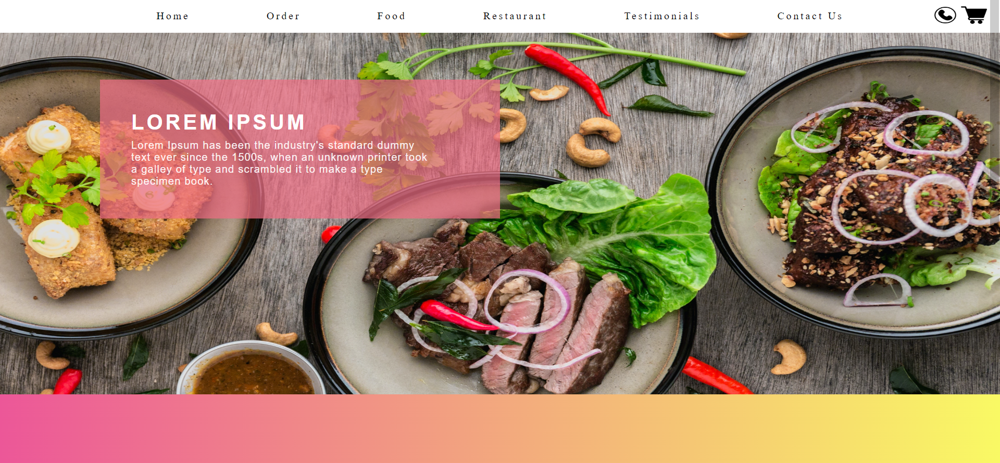
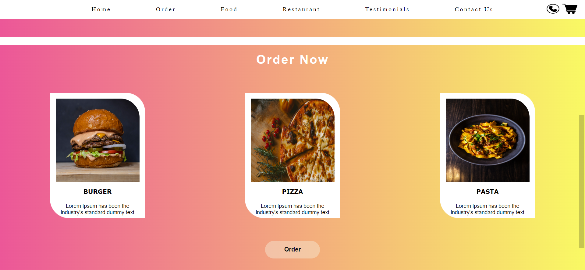

# Assignment_Sadaf_Saiyed
# FOOD ORDERING STATIC WEBPAGE
Online food ordering is the process of ordering food, for delivery or pickup, from a website or other application.
It is a responsive webpage which is accessible to different devices such as desktop, tablet and mobile.
## Technology used
* HTML
* CSS
### Output of the code
#### Output 1

#### Output 2

  
